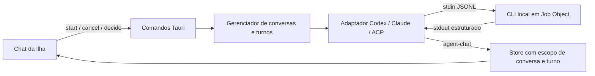

# Chat do Coucou pelas CLIs no Windows

> Atualização de 02/10/2026: na versão 0.1.2, o chat está ativo para Codex e Claude. Gemini/Copilot permanecem detectáveis para instalação e monitoramento, mas o chat fica bloqueado em todos os modos até qualificar o isolamento de hooks e MCP. Os detalhes ACP abaixo descrevem o adapter preservado; não autorizam contornar a guarda. Consulte o [guia atual](AGENTE-PESSOAL-WINDOWS.md) e a [instalação passo a passo](../README-WINDOWS.md).

## Objetivo

Usar o chat da ilha como cliente das CLIs locais de Codex, Claude Code, Gemini e GitHub Copilot. O backend inicia uma sessão controlada, envia mensagens por um protocolo estruturado e entrega respostas, atividade e pedidos de permissão à interface.

Esta entrega adiciona os adaptadores e o fluxo de uso. A compatibilidade real depende da versão, autenticação e política da CLI instalada. Testes de reducer e de protocolo não comprovam uma conversa autenticada com o modelo.

## CLI e API

| Opção no chat | Execução | Autenticação e modelo |
|---|---|---|
| Codex CLI | Processo local `codex app-server` | Autenticação existente e seleção efetiva da CLI; o Coucou não copia seus tokens. |
| Claude Code | Processo local em `stream-json` com protocolo de controle por stdin | Login da CLI e modelo efetivo nativo; ferramentas limitadas à consulta nesta entrega. |
| Gemini CLI | Processo local em ACP | Login e seleção efetiva da CLI; modo de permissão configurado pelo adaptador. |
| GitHub Copilot CLI | Processo local em ACP | Login e seleção efetiva da CLI; restrições de ferramentas conforme a conversa. |
| Anthropic API | Requisição HTTP pelo backend existente | Chave do Windows Credential Manager e modelo definido no cartão Anthropic API chat de Settings. |

A opção Anthropic API continua disponível por seleção manual, com seu histórico separado. Uma falha de CLI não muda o provider automaticamente. A chave Anthropic não é requisito para conversar com as CLIs.

O modelo configurado no cartão Anthropic API vale para essa opção. O chat CLI não oferece seletor de modelo nesta entrega. Confirme o modelo efetivo e a modalidade de autenticação na CLI antes de usar o Coucou. Uma CLI configurada com chave de API, provedor externo ou recurso tarifado continua seguindo essa configuração e seus limites; a interface não transforma esse uso em uma modalidade gratuita.

O adaptador também impõe opções por execução. No Claude, as fontes de settings, hooks, slash commands e MCP são restringidas para o modo de consulta; não se deve presumir que todas as customizações da sessão interativa serão carregadas.

## Preparação e primeiro uso

1. Instale a CLI desejada pelo método oficial e conclua seu login no terminal.
2. Confirme que a CLI inicia normalmente e que a pasta do projeto tem a confiança exigida por ela. Feche essa sessão antes de retomar seu ID pelo Coucou.
3. Reinicie o Coucou após mudar o `PATH` ou instalar uma CLI. O processo do app usa o ambiente com o qual foi iniciado.
   Ao trocar de build, saia da versão antiga antes de abrir a nova. O executável na raiz do projeto foi preservado; o build atualizado está em `windows/target/release/coucou.exe` e o instalador em `windows/release`.
4. Abra o chat da ilha e selecione o agente. Use o botão de atualização para verificar a disponibilidade do executável.
5. Informe uma pasta absoluta existente, por exemplo `D:\coucou`. O backend confirma que o caminho resolve para um diretório acessível.
6. Mantenha **Allow changes** desmarcado para começar em modo de consulta. Só habilite alterações em uma conversa na qual pretende permitir esse trabalho; o Claude está limitado à consulta nesta versão.
7. Envie a mensagem. As respostas são exibidas conforme chegam, e a atividade das ferramentas fica em uma área expansível.
8. Use **Stop** para interromper o turno. Aguarde a confirmação de término antes de enviar outro turno na mesma conversa.

Encontrar o executável no `PATH` confirma sua disponibilidade local. Isso não confirma login, acesso ao modelo, quota ou compatibilidade do protocolo.

Não é necessário instalar os hooks globais de monitoramento para usar o chat. O chat usa os processos que ele próprio controla, e a configuração de hooks continua sendo um recurso separado, aplicado apenas após a prévia e a confirmação em Settings.

## Conversas e retomada

O seletor identifica as conversas pelo agente, projeto, sufixo do ID e estado. **New** cria uma conversa independente e começa uma nova sessão nativa quando nenhum ID de retomada foi digitado explicitamente.

Ao receber o ID nativo, a interface o apresenta no campo **Native session ID**; **Copy** copia esse valor. Para retomar:

1. Termine ou feche a sessão interativa que esteja usando esse ID.
2. Escolha o agente correto e a pasta do projeto.
3. Digite o ID no campo de retomada e crie/envie a nova conversa.

O Coucou impede duas conversas gerenciadas de controlarem simultaneamente a mesma sessão nativa. Esse controle não identifica todos os terminais ou editores externos; a responsabilidade de encerrar o outro controlador permanece com quem retoma a sessão.

Trocar pasta, agente ou capacidade de escrita cria uma conversa nova. Alterar pasta ou capacidade não carrega silenciosamente o ID antigo: retomar um ID é uma escolha explícita. O backend verifica novamente a identidade da conversa e do turno.

A retomada depende da capacidade anunciada pela CLI. Gemini e Copilot precisam suportar `session/load` em ACP; uma CLI sem essa capacidade retorna uma mensagem para começar uma conversa nova. Claude exige um UUID válido de sessão. Codex usa `thread/resume` e confirma que o ID devolvido é o solicitado.

O histórico nativo pode ser retomado no processo sem importar as mensagens antigas para a interface. Ao reabrir o app, o Coucou restaura metadados; o painel começa sem os textos dos turnos anteriores.

Arquivos arrastados para a ilha não viram anexos implícitos de uma conversa CLI. O fluxo legado de arquivo permanece ligado ao chat Anthropic API. Para o chat CLI, informe o projeto e peça a leitura do arquivo dentro desse contexto; a CLI aplica suas regras e permissões.

## Matriz de funcionamento

| Agente | Transporte | Consulta | Alterações | Limites e maturidade |
|---|---|---|---|---|
| Codex | `app-server --listen stdio://`, JSONL | Política `read-only` | Política `workspace-write`, com aprovação do usuário quando a CLI a solicita | O comando da versão local verificada aparece como experimental; o cliente pede a superfície sem `experimentalApi`. Mudanças de esquema exigem nova qualificação. |
| Claude Code | `--print`, entrada/saída `stream-json`, controle por stdio | Somente `Read`, `Glob` e `Grep` | Não habilitadas nesta entrega | Pedidos consultivos inspecionáveis podem ser apresentados; Bash, escrita, MCP e entradas opacas são recusados pelo adaptador. |
| Gemini CLI | ACP v1, flag detectada em `--help` | Modo nativo `plan` | Modo nativo `default` com decisão por pedido | Se a versão não anuncia o modo exigido, o turno falha. Mudança inesperada do modo durante o turno interrompe a conversa. |
| Copilot CLI | `--acp --stdio`, ACP v1 | `--available-tools=view,glob,grep` | Ferramentas nativas, com permissões aceitas somente por pedido inspecionável | A interface ACP do Copilot está em public preview e pode mudar. |

Esses modos restringem as ferramentas e políticas da execução. O Windows Job Object controla a árvore de processos e seu encerramento; ele não cria um sandbox de acesso a arquivos.

Em ACP, o cliente anuncia callbacks de filesystem e terminal desabilitados e não entrega essas capacidades à CLI. Isso não desabilita, por si só, as ferramentas internas do processo. As restrições efetivas de consulta vêm do modo nativo Gemini ou da lista de ferramentas Copilot, somadas à validação dos pedidos. Não se deve interpretar “Allow changes desmarcado” como prova de isolamento de todas as extensões, políticas, ferramentas internas ou efeitos da configuração nativa.

A documentação oficial descreve o [App Server do Codex](https://learn.chatgpt.com/docs/app-server), o [streaming programático do Claude Code](https://code.claude.com/docs/en/headless), o [modo ACP do Gemini CLI](https://geminicli.com/docs/cli/acp-mode/) e o [servidor ACP do Copilot CLI, em public preview](https://docs.github.com/en/copilot/reference/copilot-cli-reference/acp-server). A matriz acima registra a implementação do Coucou; ela não promete todas as funcionalidades dessas interfaces.

## Pedidos de permissão

Um pedido apresentado ao usuário contém título, detalhe inspecionável e as opções **Deny** e **Allow this request**. O detalhe tem limite de 16 KiB; pedidos incompletos, não reconhecidos ou que não possam ser apresentados integralmente são recusados. Aprovação não equivale a execução concluída: o resultado depende dos eventos seguintes da CLI.

Cada resposta corresponde a `conversationId`, `runId` e `requestId`. O pedido expira em 120 segundos e só pode ser consumido uma vez. Não existe autorização permanente ou “permitir tudo” pelo cartão.

- **Allow** exige um clique, solicita foco para a ilha e revalida o pedido antes de enviar a resposta. O backend exige a janela correta, foco e app ativo.
- **Deny** não exige aquisição de foco.
- Trocar de conversa/provider ou criar outra conversa nega o cartão que está sendo escondido.
- Navegar para fora do chat ou ocultar o cartão nega as aprovações pendentes; um turno comum pode continuar sem a interface aberta.
- **Pause** impede novos turnos, cancela os turnos gerenciados e invalida seus pedidos.
- Cancelamento, timeout, término da sessão ou encerramento do processo nunca concedem permissão automaticamente.

A entrada de uma aprovação pode abrir o painel da conversa selecionada sem tomar foco automaticamente. Conversas diferentes permanecem separadas; o seletor sinaliza seus pedidos pendentes.

## Arquitetura



| Componente | Responsabilidade |
|---|---|
| `windows/src/core/bridge.ts` | Invocar `agent_chat_status`, `agent_chat_start`, `agent_chat_cancel` e `agent_chat_decide`. |
| `windows/src/core/agent-chat.ts` | Validar escopo dos eventos, manter conversas, controlar streaming/decisões e persistir somente metadados. |
| `windows/src/views/chat.ts` | Renderizar texto seguro, controles de projeto/sessão e detalhes de aprovação. |
| `windows/src-tauri/src/agent_chat/mod.rs` | Validar contexto, impedir turnos concorrentes na mesma conversa, controlar decisões e emitir eventos. |
| `windows/src-tauri/src/agent_chat/codex.rs` | Traduzir threads, turnos, ferramentas, streaming e aprovações do App Server. |
| `windows/src-tauri/src/agent_chat/claude_cli.rs` | Traduzir o protocolo de controle Claude e restringir ferramentas à consulta. |
| `windows/src-tauri/src/agent_chat/acp.rs` | Inicializar/carregar sessões ACP e validar atualizações e permissões Gemini/Copilot. |
| `windows/src-tauri/src/agent_chat/process.rs` | Resolver executáveis oficiais, iniciar sem janela e conter a árvore de processos. |
| `windows/src-tauri/src/agent_chat/transport.rs` | Transportar JSONL com limites, cancelamento, timeout e descarte de stderr. |

`agent_chat_start` confirma a aceitação do turno e inicia o trabalho de forma assíncrona. O frontend registra o listener antes da interação; a interface não aguarda o modelo dentro da resposta do comando Tauri.

Eventos usam `{ conversationId, runId, kind, data }`. As categorias são `session`, `delta`, `message`, `tool`, `status`, `approval`, `approvalResolved`, `error` e `completed`. O reducer ignora IDs desconhecidos e turnos antigos. Um evento `status` registra atividade/diagnóstico e não significa conclusão.

O launcher resolve `.exe` ou o entrypoint do pacote npm oficial por `node.exe`; não avalia o conteúdo de um shim PowerShell/CMD para executar o chat. O processo nasce suspenso, entra em um Job Object com encerramento dos filhos ao fechar o job e só então é retomado. No término normal, interrupção ou erro, o backend encerra essa árvore gerenciada.

## Limites e armazenamento

| Recurso | Limite atual |
|---|---|
| Conversas na interface | 16; a remoção de entradas antigas preserva as que têm turno ativo. |
| Mensagens visíveis por conversa | 100 e 65.536 caracteres de conteúdo agregado. |
| Entrada de uma mensagem na interface | 16.384 caracteres. |
| Atividade recente | Oito entradas, cada uma limitada a 2.000 caracteres no frontend. |
| Contextos no gerenciador Rust | Até 32 entradas e quatro turnos simultâneos; um turno por conversa. |
| Aprovações | Uma pendente por turno, no máximo oito no gerenciador, prazo de 120 segundos. |
| Frame JSONL | 1 MiB. |
| Fila durante inicialização | Até 256 frames e 8 MiB agregados. |
| Escrita em stdin | Timeout de 5 segundos. |
| Requests de inicialização/transporte | Timeout de 30 segundos; handshake Claude tem prazo próprio de 60 segundos. |
| Espera por um novo frame | Timeout de 180 segundos; não é limite absoluto da duração de todo turno. |
| Cancelamento e limpeza | Graça de até 2 segundos para confirmação; no Codex, esse prazo inclui o envio. ACP/Claude têm também o limite de escrita de 5 segundos. Espera pelo processo encerrado de até 3 segundos. |

O frontend grava em `localStorage` somente identificadores, agente, pasta, capacidade, ID nativo e data da conversa. Mensagens, saída das ferramentas e detalhes de aprovação ficam em memória. O limite de exibição não é o limite de contexto do modelo: a CLI mantém seu próprio histórico e aplica sua janela de contexto.

As CLIs podem persistir histórico, caches, logs e autenticação segundo suas configurações nativas. “Mensagens ficam em memória” descreve o armazenamento do frontend do Coucou e não impede gravações realizadas pelo processo da CLI.

O backend descarta stderr sem armazenar seu conteúdo bruto. Diagnósticos e metadados de atividade passam por saneamento para não exibir credenciais ou sequências de controle. Respostas de chat e detalhes que precisam ser revisados são renderizados como texto, sem execução de HTML recebido.

## Validação e entrega

Estado registrado durante a implementação de 2026-10-01:

| Evidência | Estado |
|---|---|
| TypeScript | `tsc --noEmit` aprovado. |
| Frontend | 43 testes aprovados, incluindo 15 casos do chat CLI. |
| Testes Rust e checks finais | 68 testes aprovados no workspace; Clippy com `-D warnings` aprovado; formatação dos arquivos novos e `git diff --check` aprovados. |
| Fixture visual | `windows/dev/chat-preview.html` usa eventos e respostas sintéticos, sem processo ou chamada a modelo. |
| Codex com turno real autenticado | CLI 0.159.2: dois turnos reais com login ChatGPT, streaming e retomada em outro processo aprovados. Consulta sem ferramentas/aprovações; edição e permissões reais ainda não qualificadas. |
| Claude, Gemini e Copilot com turno real | Claude 2.1.87 passou somente no handshake sem prompt. Conversa autenticada Claude e sessões Gemini/Copilot ainda não qualificadas; os dois últimos estão ausentes do PATH. |
| Pacote Windows do chat | NSIS x64 0.1.1 gerado e hashes conferidos no [relatório de validação](VALIDACAO-CHAT-CLI-WINDOWS-2026-10-01.md). Sem instalação/upgrade ou publicação. |

Os testes de frontend cobrem isolamento entre conversas, eventos atrasados, streaming, expiração/resolução, cancelamento, corrida durante aquisição de foco, decisões duplicadas, persistência sem conteúdo e limites. Testes puros não comprovam permissão nativa, autenticação, cobrança, execução efetiva ou compatibilidade de uma CLI específica.

Para reproduzir o frontend, a partir de `D:\coucou\windows`:

```powershell
npx tsc --noEmit
npm test
```

Para verificar a interface sem modelos, inicie o Vite e abra `/dev/chat-preview.html`. Essa página substitui as chamadas de chat por mocks locais e não faz parte das entradas de produção.

## Diagnóstico de problemas

| Sintoma | Verificação |
|---|---|
| CLI não encontrada | Instalação oficial, `PATH` do processo Coucou e presença de `node.exe` quando a CLI usa npm. Reinicie o app. |
| CLI fecha antes de responder | Confira login, confiança do projeto e versão no terminal. A interface não inicia login automaticamente. |
| Gemini não oferece modo exigido | Atualize para uma versão com ACP e o modo nativo anunciado; o adaptador não substitui consulta por execução irrestrita. |
| Não é possível retomar | Use o agente/pasta/ID corretos e feche o outro controlador; confirme suporte `session/load` para ACP. |
| Allow retorna pedido expirado | O pedido não está mais ativo ou a janela não reuniu os requisitos. A resposta anterior não deve ser reutilizada. |
| Stop não confirmou | A conversa mantém o turno ativo; não se assume encerramento apenas porque o botão foi clicado. Confira o processo antes de continuar. |
| Histórico antigo não aparece após reabrir | Somente metadados foram restaurados. A retomada do contexto acontece na CLI, sem replay do transcript na interface. |

Para a base de monitoramento multiagente e os hooks separados do chat, consulte `docs/MULTIAGENTE-WINDOWS.md` e `docs/PLANO-MULTIAGENTE-WINDOWS.md`.
